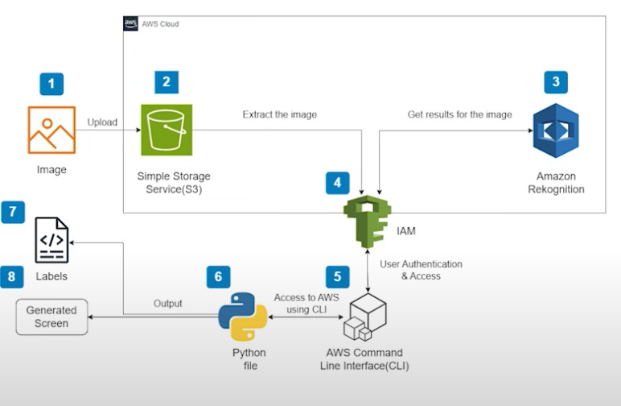

## Feito por:

- José Henrique Bernardes Vieira  
- Juan Pablo Silvério Silva  
- David Francisco Vieira  
- Vinicius Pires De Souza  
- Luis Henrique Sampaio

# 🧠 Relatório de Projeto

## *Reconhecimento de Objetos com Amazon Rekognition e Python*

---

## 📌 *1. Introdução*

Com o avanço das tecnologias de computação em nuvem e inteligência artificial, tornou-se possível desenvolver aplicações sofisticadas utilizando recursos oferecidos por provedores como a *Amazon Web Services (AWS). Entre esses recursos, o **Amazon Rekognition* se destaca como um serviço que permite o reconhecimento de objetos, rostos, textos e atividades em imagens e vídeos por meio de algoritmos de Machine Learning.

Este projeto tem como objetivo principal explorar o uso do *Amazon Rekognition* integrado ao *Amazon S3, utilizando **Python* para construir uma aplicação capaz de realizar o *upload de imagens para a nuvem, processá-las com IA e **exibir os objetos identificados automaticamente* com respectivos níveis de confiança.

---

## 🛠️ *2. Ferramentas e Tecnologias Utilizadas*

| Tecnologia / Serviço   | Descrição                                                         |
| ---------------------- | ----------------------------------------------------------------- |
| *Amazon S3*          | Armazenamento das imagens na nuvem                                |
| *Amazon Rekognition* | Análise automatizada de imagens com IA                            |
| *IAM (AWS)*          | Gerenciamento de usuários e permissões                            |
| *AWS CLI*            | Ferramenta de linha de comando para interagir com a AWS           |
| *Python 3*           | Linguagem utilizada para lógica do projeto                        |
| *Boto3*              | SDK da AWS para Python, permite comunicação com serviços da nuvem |

---

## 🔨 *3. Desenvolvimento do Projeto*

### 3.1. Criação do Bucket S3

Foi criado um bucket no Amazon S3 para armazenar as imagens que seriam analisadas. O bucket foi configurado para permitir acesso público caso desejado, e foi selecionada a região us-east-1.

### 3.2. Criação do Usuário IAM

Criamos um usuário chamado usuario-rekognition, com acesso programático e permissões específicas para os serviços utilizados:

* AmazonRekognitionFullAccess
* AmazonS3FullAccess

Essas permissões são essenciais para que o script Python possa enviar imagens e acessar o Rekognition.

### 3.3. Configuração da AWS CLI

Com o usuário IAM criado, utilizamos as credenciais geradas para configurar o AWS CLI via terminal. Isso possibilitou a comunicação direta entre o computador local e a AWS usando comandos de linha.

### 3.4. Upload da Imagem

A imagem foi enviada ao bucket S3 usando o seguinte comando:

bash
aws s3 cp ./minha-imagem.jpg s3://meu-bucket-imagens/

Esse processo transferiu a imagem local diretamente para a nuvem, deixando-a pronta para ser analisada.

### 3.5. Análise com Amazon Rekognition via Python

Foi criado um script Python chamado rotulador.py, responsável por:

* Acessar o Amazon Rekognition
* Fazer a chamada de detecção de rótulos (labels)
* Exibir os objetos detectados com nível de confiança

python
import boto3

BUCKET = 'meu-bucket-imagens'
FILENAME = 'minha-imagem.jpg'

client = boto3.client('rekognition')

response = client.detect_labels(
    Image={
        'S3Object': {
            'Bucket': BUCKET,
            'Name': FILENAME
        }
    },
    MaxLabels=10,
    MinConfidence=70
)

for label in response['Labels']:
    print(f"{label['Name']} - {label['Confidence']:.2f}%")

---

## 📈 *4. Resultados Obtidos*

Após a execução do projeto:

* Foi possível *analisar imagens com precisão* diretamente da nuvem
* A aplicação retornou rótulos como “Person”, “Car”, “Tree”, entre outros, com *porcentagens de confiança acima de 70%*
* O projeto demonstrou uma *integração eficiente* entre armazenamento, IA e automação

Os resultados demonstram o poder do Amazon Rekognition para aplicações práticas como:

* Análise de segurança (ex: detecção de pessoas)
* Catalogação de imagens
* Aplicações em e-commerce (ex: identificação de produtos)
* Inclusão em sistemas de monitoramento ou apps móveis

---

## 🎓 *5. Aprendizados*

Durante o desenvolvimento deste projeto, foram adquiridos conhecimentos importantes, tais como:

✅ Criar e configurar um bucket no Amazon S3
✅ Criar usuários IAM com permissões personalizadas
✅ Configurar o AWS CLI e interagir com a nuvem via terminal
✅ Desenvolver scripts em Python com a biblioteca boto3
✅ Utilizar IA para análise de imagens via Amazon Rekognition
✅ Interpretar resultados de IA com base em níveis de confiança

---

## ✅ *6. Conclusão*

Este projeto serviu como uma introdução prática ao uso de *inteligência artificial na nuvem com AWS*, demonstrando como é possível criar soluções inteligentes e funcionais utilizando serviços modernos como o Amazon Rekognition e Amazon S3. Além disso, reforçou o entendimento sobre segurança com IAM, automação com CLI e integração com Python.

O reconhecimento automático de objetos tem aplicações reais em diversos setores, e com este projeto é possível expandir a solução para cenários mais complexos como análise de vídeos, reconhecimento facial, e integração com APIs web ou sistemas móveis.
